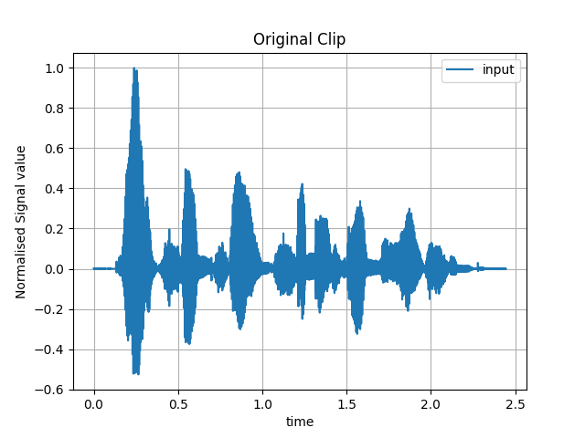

# A Compressed Sensing Approach to Denoise Audio Signals
Convex Optimization - EE5121 Term Paper

### Requirements
- Python 3+
- NumPy (For scientific and vector calculations)
- SciPy
- Sounddevice (For loading audio wav files as NumPy Arrays)

### Note:
For a given test, the input file format is ```<name of test>_<SNR of test>.wav``` and the output file format is ```out_<name of test>_<SNR of test>.wav```.
To run a test case run ```python3 main.py <name of test>_<SNR of test>.wav```.

### Notable Outputs:



